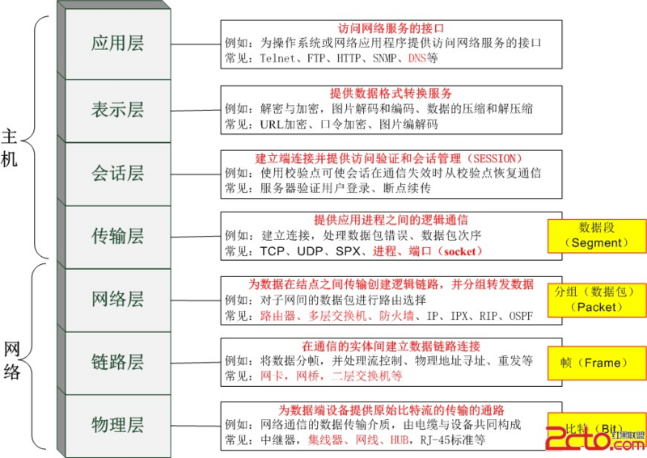
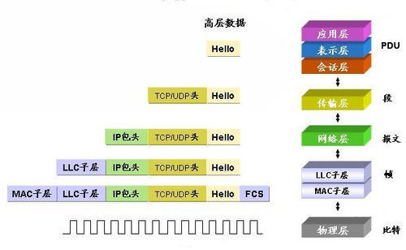
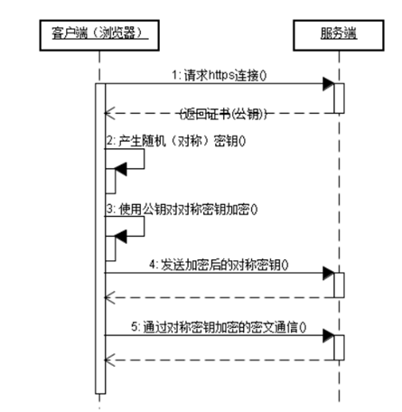

#### 1. 七层模型
想了解http，就需要了解TCP，IP协议。因为http是基于TCP，IP层上面的。如下图所示：

以前总是记不住这七层模型，但其实理解之后自然就记住了。
整张图应该从下边向上看，假设别人想发一条信息给我的电脑。首先是通过网络把信息传导到的电脑，但不能说我的电脑对于所有的信息都接受，我会判断信息，之后在处理信息，这些就是七层模型做的事情。一步一步分开来看 ，并用打电话这一创建的例子来对应：
1. 物理层 包括物理连网媒介，实际上就是布线、光纤、网卡和其它用来把两台网络通信设备连接在一起的东西。它规定了激活、维持、关闭通信端点之间的机械特性、电气特性、功能特性以及过程特性。（这就相当于电信公司的信号发射塔，接收信号而已）
2. 数据链路层 数据链路层主要作用是控制网络层与物理层之间的通信。它保证了数据在不可靠的物理线路上进行可靠的传递。它把从网络层接收到的数据分割成特定的可被物理层传输的帧，保证了传输的可靠性。（相当于发射塔让接受的信号更稳定，方便下一层的解读）
3. 网络层 很多人经常混淆2层和3层的相关问题，简单来说，如果你在谈论一个与IP地址、路由协议或地址解析协议（ARP）相关的问题，那么这就是第三层的问题。　　网络层负责对子网间的数据包进行路由选择，它通过综合考虑发送优先权、网络拥塞程度、服务质量以及可选路由的花费来决定从一个网络中两个节点的最佳路径。另外，它还可以实现拥塞控制、网际互连等功能 （相当于我们打一个长途电话，当前连接的发射站不能直接传递给另一用户，需要先传递给附近的发射站）
    到这里为止，其实信息还没有传递到我们的电脑，可以理解为信息在路由网络间传递。dddd
4. 传输层 是OSI模型中最重要的一层，它是两台计算机经过网络进行数据通信时,第一个端到端的层次，起到缓冲作用。当网络层的服务质量不能满足要求时，它将提高服务，以满足高层的要求；而当网络层服务质量较好时，它只需进行很少的工作。另外，它还要处理端到端的差错控制和流量控制等问题，最终为会话提供可靠的,无误的数据传输。（相当于我们找到了最后的信号站，可以直接发送信号给通话者，但是这层会做一些数据的整合等工作）
5. 会话层 会话层负责在网络中的两节点之间建立和维持通信，并保持会话获得同步，它还决定通信是否被中断以及通信中断时决定从何处重新发送。
6. 表示层 表示层的作用是管理数据的解密与加密，如常见的系统口令处理，当你的账户数据在发送前被加密，在网络的另一端，表示层将对接收到的数据解密。另外，表示层还需对图片和文件格式信息进行解码和编码。 （相当于发射塔给手机发送一些压缩的信息，我们手机接收到后解码）
7. 应用层 　　简单来说，应用层就是为操作系统或网络应用程序提供访问网络服务的接口，包括文件传输、文件管理以及电子邮件等的信息处理。　　应用层协议的代表包括：Telnet、FTP、HTTP、SNMP等。 （这就是真正的收到信息，相当于我们听到了对方的声音，这次对话完成了）
总结起来就是：

*打电话信息发出(www） --->发射塔收到不稳定信息流（物理层） ---> 发射塔整理信息流（链路层）---> 发射塔转给离接收人更近的发射塔（网络层IP） ---> 发射塔向接收人发送信息（传输层TCP） ---> 通话建立（会话层） ---> 解码信息（表示层） ---> 发出声音给接收人（应用层HTTP）*

#### 2. 各协议在HTTP中的用途
对于HTTP网络应用，我们在网络层用的是IP，在传输层用的是TCP。
IP： internet protocal。顾名思义，网络协议。他能确保计算机之间在网络上互相通信，但是他不检查消息是否以发送次序到达而没有损坏，因此，我们需要上一层来检验消息。于是有了TCP层
TCP： 保证信息正确次序，内容不变。同时引入端口分发给不同的服务。同时分割数据为更小的ip包，到达时重组。
HTTP： 当信息解读好，我们传给HTTP层，即为应用层。超文本传输协议（HTTP，HyperText Transfer Protocol)是互联网上应用最为广泛的一种网络协议。所有的WWW文件都必须遵守这个标准。设计HTTP最初的目的是为了提供一种发布和接收HTML页面的方法。

以上是对支撑HTTP的网络七层的概括，我们需要理解为什么要在http层下面有那么多层，每一层的目的是什么。

明白了这些之后，问题来了，这七层是怎么知道自己应该怎么解读数据，而不是说TCP层解读HTTP层。这里面就是网络数据的封装和传递了：

从这个图中，我们可以看到每一层的数据都会被一个这层的头信息包裹。
之后我们在接收到信息时再一层一层读取信息

#### 3. HTTPS原理
讲完http，我们会发现，我们传递的信息在网络上经过那么多物理层的传输，保不准会被别人截获，而我们却一点也不知道。于是我们想到要加密我们传输的数据。因为只有http层信息是我们要的，所以在这一层下面加入一层来加密信息。这一层就是SSL层，同时我们如果想传给ssl层，我们用端口443.
ssl层简称安全套阶层，主要就是加密解密。
一开始我们会说，我们就让服务器给我们一个公钥，每次用他来解密不就行了。但是这种办法不可以，因为别人同样可以截获你的公钥，毕竟公钥也是在网络上传递的。
于是我们就要想一种办法，让我们的公钥也被加密，并且这个加密方式是在服务器或者我们电脑上进行的，这样才安全
如图：

重点在这里：
1. 服务器端产生的是对称秘钥，所以只是把公钥发送出去，私钥一直在自己这里 （对称秘钥就是一个公钥，一个私钥，用公钥加密，用私钥直接能解码，但是比较慢，不能一直用这个通信）
2. 客户端首先向一个权威的服务器检查证书的合法性，如果证书合法，客户端产生一段随机数，这个随机数就作为通信的密钥，我们称之为对称密钥，用公钥加密这段随机数，然后发送到服务器
3. 服务器用密钥解密获取对称密钥，然后，双方就已对称密钥进行加密解密通信了

这里主要就HTTP相关知识进行总结，希望帮助大家！

------------------------------------------