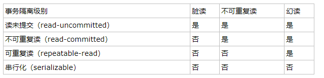
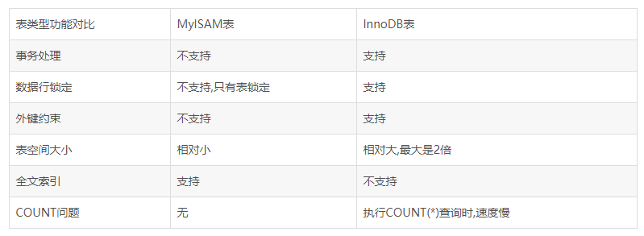

#### 1. MySQL事务处理的特性
mysql事务可以理解为一系列操作，要么成功执行，要么失败。
1. 原子性（Atomicity）：事务开始后所有操作，要么全部做完，要么全部不做，不可能停滞在中间环节。事务执行过程中出错，会回滚到事务开始前的状态，所有的操作就像没有发生一样。也就是说事务是一个不可分割的整体，就像化学中学过的原子，是物质构成的基本单位。

2. 一致性（Consistency）：事务开始前和结束后，数据库的完整性约束没有被破坏 。比如A向B转账，不可能A扣了钱，B却没收到。

3. 隔离性（Isolation）：同一时间，只允许一个事务请求同一数据，不同的事务之间彼此没有任何干扰。比如A正在从一张银行卡中取钱，在A取钱的过程结束前，B不能向这张卡转账。

4. 持久性（Durability）：事务完成后，事务对数据库的所有更新将被保存到数据库，不能回滚。

----------

#### 2. 事务的并发问题

1. 脏读：事务A读取了事务B更新的数据，然后B回滚操作，那么A读取到的数据是脏数据

2. 不可重复读：事务 A 多次读取同一数据，事务 B 在事务A多次读取的过程中，对数据作了更新并提交，导致事务A多次读取同一数据时，结果 不一致。

3. 幻读：系统管理员A将数据库中所有学生的成绩从具体分数改为ABCDE等级，但是系统管理员B就在这个时候插入了一条具体分数的记录，当系统管理员A改结束后发现还有一条记录没有改过来，就好像发生了幻觉一样，这就叫幻读。

　　小结：不可重复读的和幻读很容易混淆，不可重复读侧重于修改，幻读侧重于新增或删除。解决不可重复读的问题只需锁住满足条件的行，解决幻读需要锁表

[\[四种事物隔离级别详解及实验\]][1]

----------

#### 3. MySQL几种表的比较

MyISAM： 节约空间，读取响应速度快,表应用于读的场景比较多，支持FULLTEXT类型的索引

InnoDB： 如果应用程序需要用到事务,使用外键或需要更高的安全性,以及需要允许很多用户同时        修改某个数据表里的数据,则InnoDB数据表更值得考虑。支持行锁（某些情况下还是锁整表，如 update table set a=1 where user like '%lee%'

Memory: 存储在内存中，所以没有持久化。可以用于test中假数据的读写

实例：公司以前的一张表用的是MyISAM，突然有一天这张表不能读写几个小时。公司上下折腾了好久。最后原因是这张表用的是MyISAM，同时正好有人向表中新加入一列，同时进行索引，由于表很大，所以一直在做索引。因此整张表一直处于锁的状态。

----------

#### 4. 索引原理及原则
在MySQL执行语句中，插入或者更新操作很少有性能问题
大部分性能问题都是复杂的查询操作导致的。原因的话要从sql读取数据说起：
> 数据库数据保存在磁盘上，每次读取数据，为了提高性能，需要把部分数据读取到内存来计算。
> 然而磁盘读取非常慢，所以每次读取IO都会读取相邻的数据，称之为每次读取一页数据（page， 4k/8k）

基于以上原理，我们要设计得是每次查询都能使磁盘IO最小，因此b+树满足条件：

图中比较重要的几点：
* 红色的格子表示数据项，叶子节点存储真实数据，非叶子结点只是区间代表
* 黄色格子表示指针，不同的树可以有不同数量的指针量，每个格子指针越多，树的高度越低

如图所示，如果要查找数据项29，那么首先会把磁盘块1由磁盘加载到内存，此时发生一次IO，在内存中用二分查找确定29在17和35之间，锁定磁盘块1的P2指针，内存时间因为非常短（相比磁盘的IO）可以忽略不计，通过磁盘块1的P2指针的磁盘地址把磁盘块3由磁盘加载到内存，发生第二次IO，29在26和30之间，锁定磁盘块3的P2指针，通过指针加载磁盘块8到内存，发生第三次IO，同时内存中做二分查找找到29，结束查询，总计三次IO。真实的情况是，3层的b+树可以表示上百万的数据，如果上百万的数据查找只需要三次IO，性能提高将是巨大的，如果没有索引，每个数据项都要发生一次IO，那么总共需要百万次的IO，显然成本非常非常高。

当b+树的数据项是复合的数据结构，比如(name,age,sex)的时候，b+数是按照从左到右的顺序来建立搜索树的，比如当(张三,20,F)这样的数据来检索的时候，b+树会优先比较name来确定下一步的所搜方向，如果name相同再依次比较age和sex，最后得到检索的数据；但当(20,F)这样的没有name的数据来的时候，b+树就不知道下一步该查哪个节点，因为建立搜索树的时候name就是第一个比较因子，必须要先根据name来搜索才能知道下一步去哪里查询。比如当(张三,F)这样的数据来检索时，b+树可以用name来指定搜索方向，但下一个字段age的缺失，所以只能把名字等于张三的数据都找到，然后再匹配性别是F的数据了， 这个是非常重要的性质，即索引的最左匹配特性。

[索引及explain详解][2]
>  好的话点个赞吧!!!

  [1]: https://www.cnblogs.com/huanongying/p/7021555.html
  [2]: https://tech.meituan.com/mysql-index.html