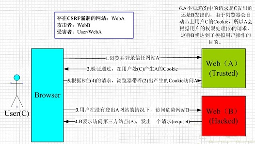

###1. CSRF （cross-site request forgery）跨站请求伪造
一句话概括：
> 当用户浏览器同时打开危险网站和正常网站，危险网站利用图片隐藏链接，或者js文件操纵用户生成错误请求给正常网站。此时因为用户会携带自己的session验证。危险网站发出的请求得以执行。




根本原因：web的隐式身份验证机制
解决办法： 为每一个提交的表单生成一个随机token， 存储在session中，每次验证表单token，检查token是否正确。

###2. XSS （cross site script）跨站脚本攻击
一句话概括：
> 网站对提交的数据没有转义或过滤不足，导致一些代码存储到系统中，其他用户请求时携带这些代码，从而使用户执行相应错误代码


例如在一个论坛评论中发表：
```php
<script>alert('hacked')</script>
```
这样的话，当其他用户浏览到这个页面，这段js代码就会被执行。当然，我们还可以执行一些更严重的代码来盗取用户信息。
解决办法： 转移和过滤用户提交的信息

###3. session攻击，会话劫持###
一句话概括：
> 用某种手段得到用户session ID，从而冒充用户进行请求


原因： 由于http本身无状态，同时如果想维持一个用户不同请求之间的状态，session ID用来认证用户
三种方式获取用户session ID：
1. 预测：PHP生成的session ID足够复杂并且难于预测，基本不可能
2. 会话劫持： URL参数传递sessionID； 隐藏域传递sessionID；比较安全的是cookie传递。但同样可以被xss攻击取得sessionID
3. 会话固定： 诱骗用户使用指定的sessionID进行登录，这样系统不会分配新的sessionID

防御方法： 
* 每次登陆重置sessionID
* 设置HTTPOnly，防止客户端脚本访问cookie信息，阻止xss攻击
* 关闭透明化sessionID
* user-agent头信息验证
* token校验

> 好的话点个赞吧！！！
更详细讲解： [\[web安全大全\]][1]


  [1]: http://www.cnblogs.com/phpstudy2015-6/tag/Web%E5%AE%89%E5%85%A8/